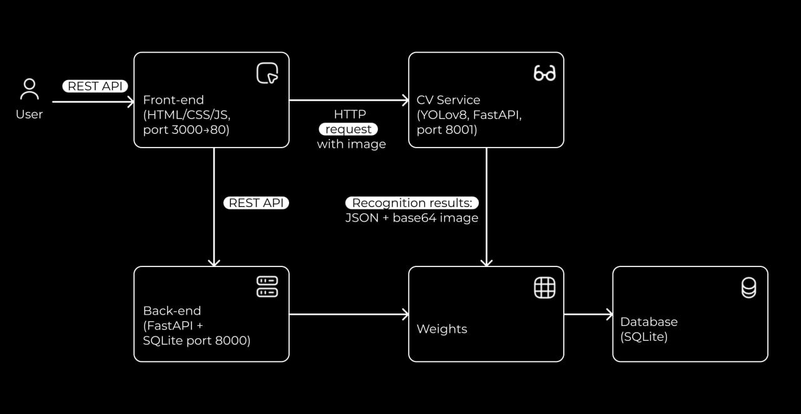

# 📘 Документация проекта «Сервис для автоматизации приёма и выдачи инструментов»

## 📑 Оглавление
1. [Введение](#введение)  
2. [Архитектура](#архитектура)  
3. [Технологический стек](#технологический-стек)  
4. [Развёртывание](#развёртывание)  
   - [Через Docker Compose](#через-docker-compose)  
   - [Без Docker](#без-docker)  
5. [Описание API](#описание-api)  
   - [Backend API](#backend-api)  
   - [CV API](#cv-api)  
6. [Фронтенд](#фронтенд)  
7. [Работа с базой данных](#работа-с-базой-данных)  
8. [Заключение](#заключение)  
 
 

---

## Введение
Проект создан в рамках хакатона. Основная цель — автоматизация приёма и выдачи инструмента авиаинженерам с использованием компьютерного зрения (YOLO) и веб-интерфейса.  

Пользователь загружает фото набора инструментов → система распознаёт их → сверяет с эталонным набором → сохраняет данные в базу.

---

## Архитектура

- **Frontend**: статика (HTML/CSS/JS), отдаётся Nginx → порт 3000 на хосте.
- **Backend**: FastAPI, бизнес-логика, обращение к CV, запись в БД → порт 8000.
- **CV**: FastAPI над YOLOv8, инференс изображения → порт 8001.
- **БД**: локально SQLite (файл в контейнере backend).
- 
### Требования к железу:
Минимальные требования: 2 ядра CPU, 4 Гб ОЗУ, 10 Гб диска, GPU-оптционально

### Время инфренса:
Среднее время инференса:
На CPU: 3 сек/изображение
На GPU: 0.2 сек/изображение

### Возможности оптимизации и масштабирования:
Оптимизация возможно через ONNX/TensorRT.
Масштабирование достигается за счет микросервисной архитектуры и контейнеризации(Docker+Yandex Cloud)

### Доступ

- Frontend: http://localhost:3000
- Backend (Swagger): http://localhost:8000/docs
- CV (Swagger): http://localhost:8001/docs

Взаимодействие:  




---

## Технологический стек
- **Язык**: Python 3.11, JavaScript (ES6)  
- **Бэкенд**: FastAPI + Uvicorn  
- **База данных**: SQLite (локально), PostgreSQL (в перспективе)  
- **CV**: Ultralytics YOLOv8  
- **Фронтенд**: HTML, CSS, JS  
- **Инфраструктура**: Docker, Docker Compose, Nginx  

---

## Развёртывание

### Через Docker Compose
```bash
git clone https://github.com/KaktusYozhika/MoscowHack.git
cd MoscowHack
docker compose up --build
```

### Без Docker
```bash
git clone https://github.com/KaktusYozhika/MoscowHack.git
cd MoscowHack
python -m venv .venv
source .venv/bin/activate   # для Linux/Mac
# .venv\Scripts\activate    # для Windows
pip install -r requirements.txt
uvicorn app.main:app --reload --host 0.0.0.0 --port 8000
```

## Описание API

### Backend API
Все методы реализованы на FastAPI (порт 8000 в контейнере backend).
Формат данных: application/json (кроме загрузки изображений).

База URL: http://localhost:8000
Swagger: http://localhost:8000/docs

#### POST /api/process-tools
Обрабатывает операцию выдачи или сдачи инструментов.
Принимает изображение, отправляет его в CV-сервис, сохраняет результат распознавания в БД.

Form-поля:
- operation_type — issue | return
- tabel_id — табельный номер (int)
- recognition_threshold — порог распознавания в процентах (0–100), по умолчанию 50
- image — файл изображения

#### GET /api/issues
Возвращает список всех записей о выдаче инструментов из таблицы tool_issues.
Ответ (пример)
```json[
  {
    "IdOrder": 1,
    "TabelID": 1005,
    "time": "2025-09-29T18:00:00",
    "image_path": "uploaded_images/123.jpg",
    "screwdriver_minus": 1,
    "pliers": 0,
    "side_cutters": 1
  }
]
```
#### GET /api/returns
Возвращает список всех записей о сдаче инструментов из таблицы tool_returns.
Ответ (пример)
```json[
  {
    "IdOrder": 5,
    "TabelID": 1007,
    "time": "2025-09-29T18:10:00",
    "image_path": "uploaded_images/456.jpg",
    "screwdriver_minus": 0,
    "pliers": 1,
    "side_cutters": 0
  }
]
```
#### GET /api/db-status
Проверка состояния базы данных и директории загруженных изображений.
Ответ (пример)
```json{
  "tool_issues_count": 15,
  "tool_returns_count": 12,
  "database_file": "tools.db",
  "uploaded_images_count": 27
}
```

### CV API
- Использует модель **YOLOv8** для детекции 11 классов инструментов.  
- На вход принимает изображение (JPG/PNG).  
- На выходе возвращает список предсказаний:  
  ```json
  {
    "class": "Разводной ключ",
    "confidence": 0.87,
    "bbox": [120, 80, 50, 70]
  }
  ```
#### GET /health
Проверка работоспособности сервиса.
Ответ (пример)
```json{
  "status": "ok"
}
```
#### POST /predict
Запускает инференс модели YOLO над загруженным изображением.
Возвращает список найденных инструментов с их координатами и уровнями доверия, а также изображение с нанесёнными боксами в формате base64.
Параметры формы (multipart/form-data
- file (file, required): изображение.
- conf (float, optional, default=0.25): минимальный уровень confidence для предсказаний.

#### Особенности работы
- Веса модели (best.pt) хранятся в папке /app/weights внутри контейнера.
- Используется метод YOLO.predict() с параметрами:
   - imgsz=1280 — размер изображения на входе,
   - conf — порог confidence,
   - agnostic_nms=True,
   - iou=0.45.
- Отрисовка результатов идёт через встроенный метод plot().
- Возврат изображения — в base64 для удобной передачи на фронт.
---

## Фронтенд
Фронтенд реализован на HTML/CSS/JavaScript и разворачивается в контейнере с Nginx.
Пользовательский интерфейс работает через браузер и общается с бекендом по REST API.

**Архитектура вызовов**
1. Пользователь открывает веб-страницу (http://localhost:3000 или на продакшн-домене).
2. Фронтенд (Nginx) отдает статические файлы (index.html, script.js, styles.css).
3. В script.js прописан API_BASE_URL (обычно http://localhost:8000 или http://backend:8000 в Docker).
4. Все действия пользователя (загрузка фото, выбор операции «Выдача/Сдача», проверка табельного номера) → отправляют HTTP-запросы на бекенд API.
5. Backend (FastAPI) принимает данные, вызывает CV-сервис (/predict) и сохраняет результат в базу.
6. Фронтенд обновляет таблицу и картинку с результатами (в том числе отрисованные боксы) 

**Основные сценарии взаимодействия**
1. Проверка наличия инструментов
- UI: Пользователь вводит табельный номер, загружает фото, жмёт кнопку «Проверить».
- JS: Форма собирается в FormData, отправляется POST /api/process-tools.
- Backend: обрабатывает фото, сохраняет результат, возвращает JSON.
- UI: обновляет таблицу инструментов, статус соответствия и картинку с разметкой.
2. Скачивание отчёта
- JS: берёт данные последнего распознавания из localStorage и формирует JSON.
- UI: создаёт файл instrument_report_YYYY-MM-DD_TABEL.json и скачивает пользователю.

**Используемые эндпоинты бекенда**
- POST /api/process-tools — основная точка вызова при проверке.
- GET /api/issues — история выдачи.
- GET /api/returns — история возврата.
- GET /api/db-status — статистика БД.
---

## Работа с базой данных
Для хранения используется:
- **SQLite** — по умолчанию (локально, прототип/тест).  
- **PostgreSQL** — для продакшена и масштабирования.  

### Структура БД
В проекте определены две основные таблицы:
**Таблица tool_issues (выдача инструментов)**
| Поле                              | Тип      | Описание                              |
| --------------------------------- | -------- | ------------------------------------- |
| `IdOrder` (PK)                    | Integer  | Уникальный идентификатор записи       |
| `TabelID`                         | Integer  | Табельный номер сотрудника            |
| `time`                            | DateTime | Время регистрации операции            |
| `image_path`                      | String   | Путь к исходному изображению          |
| `screwdriver_minus`               | Integer  | Количество распознанных «Отвертка –»  |
| `screwdriver_plus`                | Integer  | Количество «Отвертка +»               |
| `screwdriver_on_the_offset_cross` | Integer  | «Отвертка на смещённый крест»         |
| `whirlpool`                       | Integer  | Количество «Коловорот»                |
| `contouring_pliers`               | Integer  | Количество «Пассатижи контровочные»   |
| `pliers`                          | Integer  | Количество «Пассатижи»                |
| `sharnitsa`                       | Integer  | Количество «Шарница»                  |
| `adjustable_wrench`               | Integer  | Количество «Разводной ключ»           |
| `oil_can_opener`                  | Integer  | Количество «Открывашка для банок»     |
| `horn_wrench_union`               | Integer  | Количество «Ключ рожковый/накидной ¾» |
| `side_cutters`                    | Integer  | Количество «Бокорезы»                 |

**Таблица tool_returns (сдача инструментов)**
Структура полностью аналогична tool_issues, но фиксирует факты возврата.

### Хранение данных
- Каждая операция (выдача или возврат) создаёт новую запись в соответствующей таблице.
- В таблицу сохраняются:
   - табельный номер,
   - путь к изображению,
   - количество распознанных инструментов по каждому классу.
- Изображение хранится в файловой системе (uploaded_images/), в базе сохраняется только путь.

### Доступ к данным через API
1. Получение всех записей о выдаче
GET /api/issues
Возвращает список JSON-объектов с полями из таблицы tool_issues.

2. Получение всех записей о сдаче
GET /api/returns
Возвращает список JSON-объектов с полями из таблицы tool_returns.

3. Получение статистики
GET /api/db-status

---


## Заключение
Сервис решает задачу автоматизации приёма и выдачи инструментов авиаинженерам за счёт комбинации веб-интерфейса, бэкенда на FastAPI и модуля компьютерного зрения на YOLOv8.  
Архитектура построена модульно, поэтому проект можно запускать как локально (через Docker Compose), так и переносить в облако для масштабирования.  


